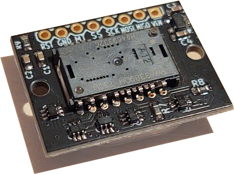

# PMW3389 Mouse
This code is for a custom 3D printed mouse that utilizes the PMW3389 sensor.
The video about this project can be found here: https://youtu.be/qmX8vL-GbxU

# Code history:
* Original version of this code: https://github.com/dkao/Kensington_Expert_Mouse_PMW3389_Arduino by dkao
* Base source code: https://github.com/mrjohnk/PMW3389DM by mrjohnk

# Parts list
* (1) PMW3389 Module: https://www.tindie.com/products/citizenjoe/pmw3389-motion-sensor/
  * 
* (1) Arduino Pro Micro
* (6) Switches (Kailh Choc): https://www.amazon.com/KAILH-Official-Chocolate-Mechanical-Keyboard/dp/B0B3MLZJ8K?th=1
* (1) Rotary encoder - model PEC12R-4220F-S0024: https://www.digikey.com/en/products/detail/bourns-inc/PEC12R-4220F-S0024/4499653
* (10) 10K Resistors
* (2) 0.1uF Capacitors
* Fine guage wire

# Sensor module pinout
* MI = MISO
* MO = MOSI
* SS = Slave Select / Chip Select
* SC = SPI Clock
* MT = Motion (active low interrupt line)
* RS = Reset
* GD = Ground
* VI = Voltage in up to +5.5V (will work with 3.3v)

# Sketch Descriptions
* PMW3389DM-Mouse/
  * Mouse with  high polling rate and 4 main buttons: Left, Right, Middle, Back, plus 2 user-definable Keyboard buttons
  * Default CPI and debounce time can be set (see #define sections in the source code)
  * Cycle through CPI with button combo (back + right click), LED will update to show which mode is selected

# How to use
  * Build the circuit as described.
  * (Arduino only) Copy the /library/AdvMouse/ to your Arduino library folder
  * Load PMW3389DM-Mouse on Arduino IDE.
    * Change dx, dy to positive values if input is reversed
  * Upload code to Arduino
  * Enjoy!
